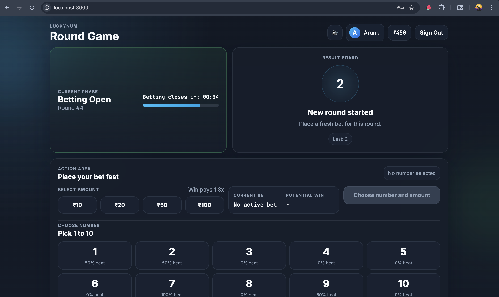

# LuckyNum

Static Supabase-powered number betting game built for free hosting on GitHub Pages or Vercel.



## Recommended Repository Name

`luckynum`

## Recommended Description

`Static Supabase-powered betting game with email auth, persistent player state, and free deployment on GitHub Pages or Vercel.`

## Features

- Static frontend only: `index.html`, `styles.css`, `app.js`
- Supabase email/password auth
- Remote game state persistence with local fallback
- Browser audio effects
- No build step
- Works on GitHub Pages and Vercel

## Tech Stack

- HTML
- CSS
- Vanilla JavaScript
- Supabase Auth + Postgres

## Local Development

Run a static server from the project root:

```bash
cd /Users/arunkumar/Downloads/lucky-number
python3 -m http.server 8000
```

Open:

```text
http://localhost:8000
```

Do not open `index.html` directly with `file://`.

## Supabase Setup

This project is already wired to:

- Project ref: `pggdyjjwwvzwiscsqqas`

If you need to apply the schema again:

```bash
supabase link --project-ref pggdyjjwwvzwiscsqqas
supabase db push
```

For fast testing, disable `Confirm email` in Supabase Auth if you want signup to create a session immediately.

## GitHub Pages Deployment

1. Push this repository to GitHub.
2. In GitHub, open `Settings -> Pages`.
3. Under `Build and deployment`, choose:
   - `Source: Deploy from a branch`
   - Branch: `main`
   - Folder: `/ (root)`
4. Save.
5. Wait for the Pages URL to be published.

Expected output:

- `https://<your-github-username>.github.io/luckynum/`

## Vercel Deployment

1. Push the repository to GitHub.
2. Import the repo into Vercel.
3. Framework preset: `Other`
4. Build command: leave empty
5. Output directory: leave empty
6. Deploy

Because this app is static, no additional build configuration is required.

## Production Notes

- Replace the hardcoded publishable key strategy with environment injection if you later add a build pipeline.
- Configure a custom SMTP provider in Supabase for production signup emails.
- Keep Row Level Security enabled on all user-owned tables.
- Use a single canonical site URL in Supabase Auth settings once the final domain is chosen.

## Project Structure

```text
.
├── index.html
├── styles.css
├── app.js
└── supabase/
    ├── config.toml
    └── migrations/
```

## License

Private / not specified.
